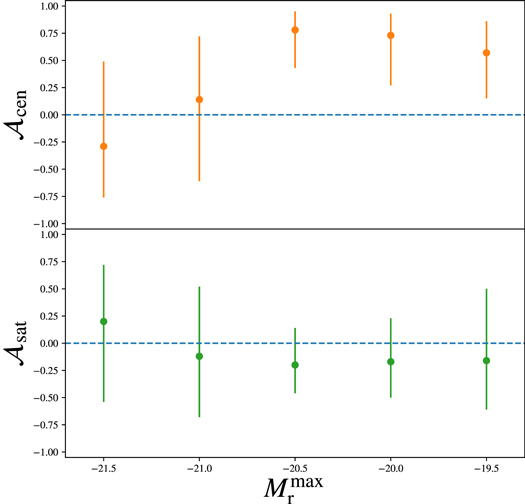
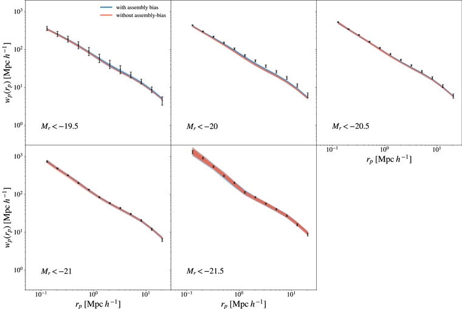
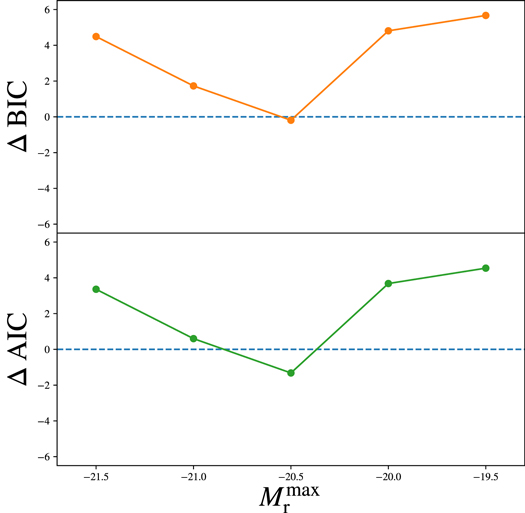

# gambly = searching for Galaxy AssMBLY bias in the Sloan Digital Sky Survey (SDSS)
------------
Searching for Galaxy assembly bias in the two-point correlation functions of galaxies in the SDSS Main sample.
In this project, we investigate whether there is a secondary property beyond dark matter halo mass that can describe the spatial distribution of galaxies.

## Detection or non-detection?

68 percentile of the posterior probability distribution over assembly bias parameters conditioned on the SDSS 2point correlations. The constraints for the central assembly bias (top panel) are mostly consistent with zero except for the data with Mr < -20.5. We find no evidence for the existence of assembly bias in the satellite galaxies (bottom panel).

## SDSS two-point functions and the posterior predictions

Comparison between the posterior predictions of two-point functions and the data (black errorbars). Predictions from the standard halo mass only model and the model with secondary halo property are shown in red and blue respectively. 
The dark and light shaded regions mark the 68% and the 95% confidence intervals. 

The predictions of the two models are mostly consistent, but the model with a secondary halo property ssem to provide a better fit for the galaxy sample with Mr < -20.5.

## Model comparison

We use information criteria (IC) to compare the perforemances of the two model: IC punishes models with more complexity and models with lower maximum likelihood (less probable models). The model with a lower IC is prefered. 
Here the difference between the IC's is defined as IC (model with secondary halo properties) - IC (model without any secondary property). Both AIC and BIC prefer the model with less complexity: the mass-only model. The only exception is the data with Mr<-20.5 for which the AIC is lower for the more complex model.

### Authors: 
Mohammadjavad Vakili (CCPP, NYU), ChangHoon Hahn (CCPP, NYU)
